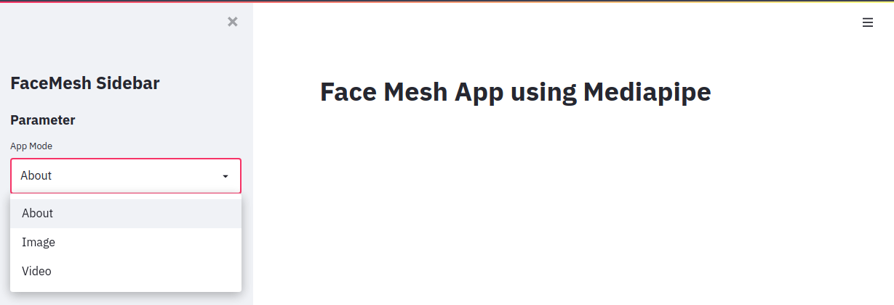
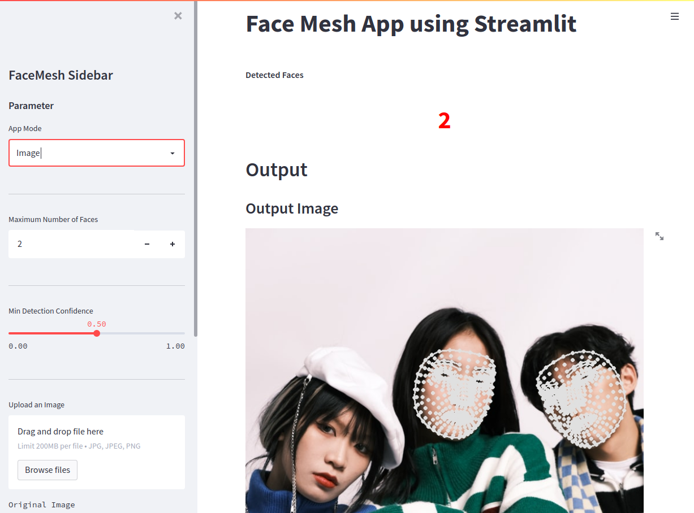
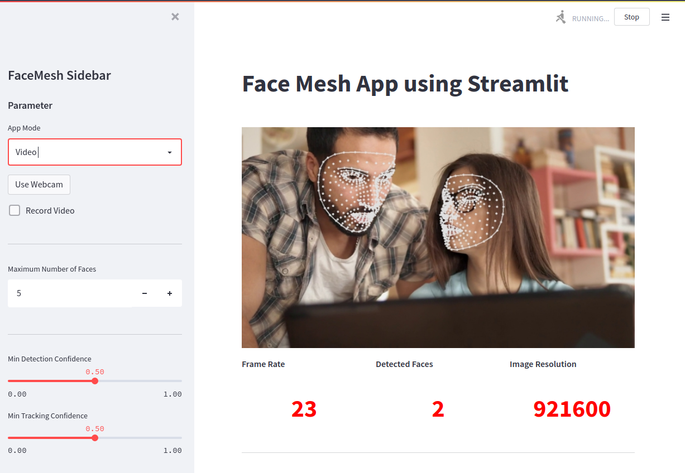

# Python Vision

This code is based on a free tutorial by Agumented Startups. All free tutorials available on [augmentedstartups.com](https://www.augmentedstartups.com/visionstore). Changes made:

- Updated all dependencies to latest version
- Removed deprecation errors
- Added new demo files [see sources](/video-and-image-source.md)

<!-- TOC -->

- [Python Vision](#python-vision)
  - [Face Landmark Detection](#face-landmark-detection)
    - [Basic Setup](#basic-setup)
    - [StreamLit](#streamlit)
  - [Create About Page](#create-about-page)
  - [Create Image Page](#create-image-page)
  - [Create Video Page](#create-video-page)

<!-- /TOC -->

## Face Landmark Detection
 
### Basic Setup

Go to Augmented Startups and open the [Face Landmark Detection StreamLit User Interface](https://www.augmentedstartups.com/face-mesh-Stream-Lit-UI) project page. Scroll down and download the project setup files:

```bash
mkdir /opt/Python/streamLit/ cd /opt/Python/streamLit/ 
wget https://www.augmentedstartups.com/resource_redirect/downloads/sites/104576/themes/2148177103/downloads/yWtJ2GTTUmbdL4paud0M_Face-Mesh-MediaPipe-StreamLit.zip
unzip yWtJ2GTTUmbdL4paud0M_Face-Mesh-MediaPipe-StreamLit.zip
```

The project contains a `requirements.txt` file that we can use to install the following dependencies into your 
virtual environment:

```bash
opencv_python_headless==4.5.2.54
streamlit==0.82.0
mediapipe==0.8.4.2
numpy==1.18.5
Pillow==8.2.0
```

```bash
pip install -r requirements.txt
```

### StreamLit

[Streamlit](https://docs.streamlit.io) is an open-source Python library that makes it easy to create and share beautiful, custom web apps for 
machine learning and data science. In just a few minutes you can build and deploy powerful data apps.

Create a new Python file `face_mesh_app.py` and import the dependencies:

```python
import streamlit as st
import mediapipe as mp
import cv2 as cv
import numpy as np
import tempfile
import time
from PIL import Image
```

Test your installation by running the following and opening your browser on `localhost:8501`:

```python
st.title('Face Mesh App using Mediapipe')
```

```bash
streamlit run face_mesh_app.py
```

You should see the title displayed on the Top of your page. Ok now we can continue building the rest of the page:

```python
# Basic App Scaffolding
st.title('Face Mesh App using Streamlit')

st.markdown(
    """
    <style>
    [data-testid="stSidebar"][aria-expanded="true"] > div:first-child{
        width: 350px
    }
    [data-testid="stSidebar"][aria-expanded="false"] > div:first-child{
        width: 350px
        margin-left: -350px
    }
    </style>
    """,
    unsafe_allow_html=True,
)

# Create Sidebar
st.sidebar.title('FaceMesh Sidebar')
st.sidebar.subheader('Parameter')

# Define available pages in selection box
app_mode = st.sidebar.selectbox(
    'App Mode',
    ['About','Image','Video']
)
```



Make sure that the image dimensions do not exceed the dimensions of the page - else resize:

```python
# Resize Images to fit Container
@st.cache()
# Get Image Dimensions
def image_resize(image, width=None, height=None, inter=cv.INSTER_AREA):
    dim = None
    (h,w) = image.shape[:2]

    if width is None and height is None:
        return image

    if width is None:
        r = width/float(w)
        dim = (int(w*r),height)

    else:
        r = width/float(w)
        dim = width, int(h*r)

    # Resize image
    resized = cv.resize(image,dim,interpolation=inter)

    return resized
```

## Create About Page

```python
# About Page

if app_mode == 'About':
    st.markdown('''
                ## Face Mesh \n
                In this application we are using **MediaPipe** for creating a Face Mesh. **StreamLit** is used to create the Web Graphical User Interface (GUI) \n
                
                - [Github](https://github.com/mpolinowski/streamLit-cv-mediapipe) \n
    ''')

## Add Sidebar and Window style
st.markdown(
    """
    <style>
    [data-testid="stSidebar"][aria-expanded="true"] > div:first-child{
        width: 350px
    }
    [data-testid="stSidebar"][aria-expanded="false"] > div:first-child{
        width: 350px
        margin-left: -350px
    }
    </style>
    """,
    unsafe_allow_html=True,
)
```

## Create Image Page



```python
elif app_mode == 'Image':
    drawing_spec = mp.solutions.drawing_utils.DrawingSpec(thickness=2, circle_radius=1)

    st.sidebar.markdown('---')

    ## Add Sidebar and Window style
    st.markdown(
        """
        <style>
        [data-testid="stSidebar"][aria-expanded="true"] > div:first-child{
            width: 350px
        }
        [data-testid="stSidebar"][aria-expanded="false"] > div:first-child{
            width: 350px
            margin-left: -350px
        }
        </style>
        """,
        unsafe_allow_html=True,
    )

    st.markdown("**Detected Faces**")
    kpil_text = st.markdown('0')

    max_faces = st.sidebar.number_input('Maximum Number of Faces', value=2, min_value=1)
    st.sidebar.markdown('---')

    detection_confidence = st.sidebar.slider('Min Detection Confidence', min_value=0.0,max_value=1.0,value=0.5)
    st.sidebar.markdown('---')

    img_file_buffer = st.sidebar.file_uploader("Upload an Image", type=["jpg","jpeg","png"])
    if img_file_buffer is not None:
        image = np.array(Image.open(img_file_buffer))

    else:
        demo_image = DEMO_IMAGE
        image = np.array(Image.open(demo_image))

    st.sidebar.text('Original Image')
    st.sidebar.image(image)

    face_count=0

    ## Dashboard
    with mp.solutions.face_mesh.FaceMesh(
        static_image_mode=True, #Set of unrelated images
        max_num_faces=max_faces,
        min_detection_confidence=detection_confidence
    ) as face_mesh:

            results = face_mesh.process(image)
            out_image=image.copy()

            #Face Landmark Drawing
            for face_landmarks in results.multi_face_landmarks:
                face_count += 1

                mp.solutions.drawing_utils.draw_landmarks(
                    image=out_image,
                    landmark_list=face_landmarks,
                    connections=mp.solutions.face_mesh.FACE_CONNECTIONS,
                    landmark_drawing_spec=drawing_spec
                )

                kpil_text.write(f"<h1 style='text-align: center; color:red;'>{face_count}</h1>", unsafe_allow_html=True)

            st.subheader('Output Image')
            st.image(out_image, use_column_width=True)
```

## Create Video Page



```python
elif app_mode == 'Video':

    st.set_option('deprecation.showfileUploaderEncoding', False)

    use_webcam = st.sidebar.button('Use Webcam')
    record = st.sidebar.checkbox("Record Video")

    if record:
        st.checkbox('Recording', True)

    drawing_spec = mp.solutions.drawing_utils.DrawingSpec(thickness=2, circle_radius=1)

    st.sidebar.markdown('---')

    ## Add Sidebar and Window style
    st.markdown(
        """
        <style>
        [data-testid="stSidebar"][aria-expanded="true"] > div:first-child{
            width: 350px
        }
        [data-testid="stSidebar"][aria-expanded="false"] > div:first-child{
            width: 350px
            margin-left: -350px
        }
        </style>
        """,
        unsafe_allow_html=True,
    )

    max_faces = st.sidebar.number_input('Maximum Number of Faces', value=5, min_value=1)
    st.sidebar.markdown('---')
    detection_confidence = st.sidebar.slider('Min Detection Confidence', min_value=0.0,max_value=1.0,value=0.5)
    tracking_confidence = st.sidebar.slider('Min Tracking Confidence', min_value=0.0,max_value=1.0,value=0.5)
    st.sidebar.markdown('---')

    ## Get Video
    stframe = st.empty()
    video_file_buffer = st.sidebar.file_uploader("Upload a Video", type=['mp4', 'mov', 'avi', 'asf', 'm4v'])
    temp_file = tempfile.NamedTemporaryFile(delete=False)

    if not video_file_buffer:
        if use_webcam:
            video = cv.VideoCapture(0)
        else:
            video = cv.VideoCapture(DEMO_VIDEO)
            temp_file.name = DEMO_VIDEO

    else:
        temp_file.write(video_file_buffer.read())
        video = cv.VideoCapture(temp_file.name)

    width = int(video.get(cv.CAP_PROP_FRAME_WIDTH))
    height = int(video.get(cv.CAP_PROP_FRAME_HEIGHT))
    fps_input = int(video.get(cv.CAP_PROP_FPS))

    ## Recording
    codec = cv.VideoWriter_fourcc('a','v','c','1')
    out = cv.VideoWriter('output1.mp4', codec, fps_input, (width,height))

    st.sidebar.text('Input Video')
    st.sidebar.video(temp_file.name)

    fps = 0
    i = 0

    drawing_spec = mp.solutions.drawing_utils.DrawingSpec(thickness=2, circle_radius=1)

    kpil, kpil2, kpil3 = st.columns(3)

    with kpil:
        st.markdown('**Frame Rate**')
        kpil_text = st.markdown('0')

    with kpil2:
        st.markdown('**Detected Faces**')
        kpil2_text = st.markdown('0')

    with kpil3:
        st.markdown('**Image Resolution**')
        kpil3_text = st.markdown('0')

    st.markdown('<hr/>', unsafe_allow_html=True)


    ## Face Mesh
    with mp.solutions.face_mesh.FaceMesh(
        max_num_faces=max_faces,
        min_detection_confidence=detection_confidence,
        min_tracking_confidence=tracking_confidence

    ) as face_mesh:

            prevTime = 0

            while video.isOpened():
                i +=1
                ret, frame = video.read()
                if not ret:
                    continue

                results = face_mesh.process(frame)
                frame.flags.writeable = True

                face_count = 0
                if results.multi_face_landmarks:

                    #Face Landmark Drawing
                    for face_landmarks in results.multi_face_landmarks:
                        face_count += 1

                        mp.solutions.drawing_utils.draw_landmarks(
                            image=frame,
                            landmark_list=face_landmarks,
                            connections=mp.solutions.face_mesh.FACEMESH_CONTOURS,
                            landmark_drawing_spec=drawing_spec,
                            connection_drawing_spec=drawing_spec
                        )

                # FPS Counter
                currTime = time.time()
                fps = 1/(currTime - prevTime)
                prevTime = currTime

                if record:
                    out.write(frame)

                # Dashboard
                kpil_text.write(f"<h1 style='text-align: center; color:red;'>{int(fps)}</h1>", unsafe_allow_html=True)
                kpil2_text.write(f"<h1 style='text-align: center; color:red;'>{face_count}</h1>", unsafe_allow_html=True)
                kpil3_text.write(f"<h1 style='text-align: center; color:red;'>{width*height}</h1>",
                                 unsafe_allow_html=True)

                frame = cv.resize(frame,(0,0), fx=0.8, fy=0.8)
                frame = image_resize(image=frame, width=640)
                stframe.image(frame,channels='BGR', use_column_width=True)
```
